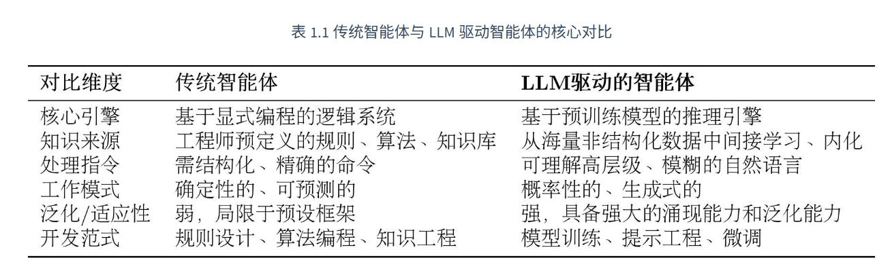
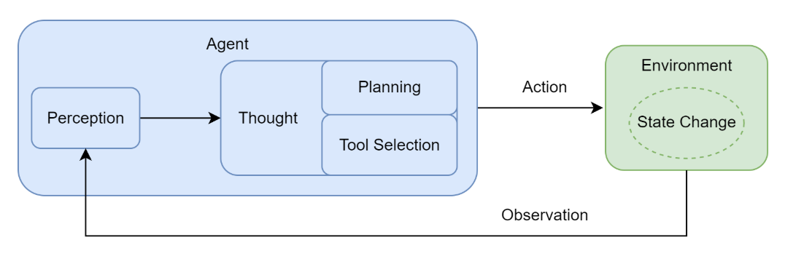

# 自学agent

## 三种**系统环境**
| 系统               | 类型         | 是否独立    |
| ---------------- | ---------- | ------- |
| Windows          | 主系统        | 真实系统    |
| WSL Linux        | Windows子系统 | 不是完整虚拟机 |
| VirtualBox Linux | 虚拟机系统      | 完整虚拟机   |

```
Windows
   │
   ├─ WSL (Linux子系统)
   │      └ docker-desktop
   │
   └ VirtualBox
          └ Linux虚拟机 e.g. Ubuntu Linux
```
### WSL
Windows Subsystem for Linux: Windows里的Linux子系统
### VirtualBox 的虚拟机系统
特点：完整操作系统； 独立硬盘； 独立内存； 可以开机关机
### Docker
容器平台（Container Platform）：可在 Linux 里快速运行软件环境。 Docker原生是linux技术: Linux进程 + 隔离

**核心思想**：软件 + 环境一起打包
1. **Image**（镜像）

    镜像：已经打包好的软件环境。下载一次就能反复用。
    
    e.g. 软件安装包 + 操作系统 + 依赖 (+ 配置文件 + 启动脚本...)
    
    e.g. 下载 MySQL 的完整环境 `docker pull mysql`
2. **Container**（容器）
    
    容器是：运行起来的镜像
    ```
    镜像 = 模板
    容器 = 实例
    ```
```
Windows
   │
   └ WSL Linux
          └ Docker Engine
                └ Container 软件
```
Docker 可以一键启动
* Python
* AI模型
* 数据库
* OpenClaw
* Redis
* Nginx

e.g. `docker run mysql` 
    
docker会
1. 下载 mysql 镜像
2. 创建容器
3. 启动数据库

特点：
1. 环境一致
    
    开发电脑能跑
    服务器一定能跑
2. 安装简单
    
    不用配置环境
3. **隔离性**好
    
    不同软件互不影响
4. 部署快
    
    几分钟部署服务器

## github 自学agent
从第一性原理出发，系统讲解智能体设计、构建与协作的实战指南。https://github.com/datawhalechina/Hello-Agents?tab=readme-ov-file
```
hello-agents
│
├ docs (markdown 文档, 教学内容)
│   ├ chapter1
│   ├ chapter2
│   ├ chapter3
│
├ code (教程里的 参考实现)
│   ├ react_agent
│   ├ memory_agent
│
├ Extra-Chapter (扩展内容:面试题 etc.)
│
├ Co-creation-projects (社区共建项目)
│
├ README.md
```

Agent 构建
1. 软件工程类 Agent,如 Dify，Coze，n8n
   
   流程驱动的软件开发，LLM 作为数据处理的后端
2. AI 原生的 Agent
   
   以 AI 驱动的 Agent

多智能体系统（Multi-Agent System, MAS）：多个智能体分工、协作、甚至辩论。自主规划、调用工具、解决复杂问题的“行动者”

### chapter 1 - Agent基础 + LLM基础
智能体被定义为任何能够通过**传感器Sensors**感知其所处环境（Environment），并**自主**地通过**执行器Actuators**采取行动(action)以达成特定目标的实体。

**传感器**返回数据流, 如摄像头、麦克风、雷达或各类**应用程序编程接口（Application Programming Interface, API）**

#### 传统agent
* 反射智能体（Simple Reflex Agent）
  
    决策核心：“条件-动作”

    如：自动恒温器-若传感器感知的室温高于设定值，则启动制冷系统。

    这种智能体完全依赖于当前的感知输入，不具备记忆或预测能力。它像一种数字化的本能，可靠且高效，但也因此无法应对需要理解上下文的复杂任务。
* 基于模型的反射智能体（Model-Based Reflex Agent）
    
    拥有一个内部的世界模型（World Model），用于追踪和理解环境中那些无法被直接感知的方面。
* 基于目标的智能体（Goal-Based Agent）
    
    它的行为不再是被动地对环境做出反应，而是主动地、有预见性地选择能够导向某个特定未来状态的行动。这类智能体需要回答的问题是：“我应该做什么才能达成目标？”。
* 基于效用的智能体（Utility-Based Agent）
    
    核心目标不再是简单地达成某个特定状态，而是最大化期望效用,当多个目标权衡。
* **学习型智能体**（Learning Agent）
    不依赖预设，而是通过与环境的互动自主学习。**强化学习**（Reinforcement Learning, RL）**是实现这一思想最具代表性的路径。一个学习型智能体包含一个性能元件（即我们前面讨论的各类智能体）和一个学习元件。学习元件通过观察性能元件在环境中的行动所带来的结果来不断修正性能元件的决策策略。如：alpha go 下围棋

#### 大语言模型驱动的新范式
大语言模型驱动的 LLM 智能体，其核心决策机制与传统智能体存在本质区别。

#### 智能体的类型
##### 基于内部决策架构的分类
从简单的**反应式**智能体，到引入内部模型的**模型式**智能体，再到更具前瞻性的基于**目标**和基于**效用**的智能体。此外，学习能力则是一种可赋予上述所有类型的**元能力**，使其能通过经验自我改进。

##### 基于时间与反应性的分类
追求速度的**反应性（Reactivity）与追求最优解的规划性（Deliberation）**之间的平衡。决策时间-决策质量
* 反应式智能体 (Reactive Agents)
* 规划式智能体(Deliberative Agents)
* 混合式智能体(Hybrid Agents)
  
    一种经典的混合架构是分层设计：底层是一个快速的反应模块，处理紧急情况和基本动作；高层则是一个审慎的规划模块，负责制定长远目标。
    
    而现代的 LLM 智能体，则展现了一种更灵活的混合模式。它们通常在一个“思考-行动-观察”的循环中运作，巧妙地将两种模式融为一体：

    **规划**(Reasoning) ：在“思考”阶段，LLM 分析当前状况，规划出下一步的合理行动。这是一个审议过程。

    **反应**(Acting & Observing) ：在“行动”和“观察”阶段，智能体与外部工具或环境交互，并立即获得反馈。这是一个反应过程。

    通过这种方式，智能体将一个需要长远规划的宏大任务，分解为一系列“规划-反应”的微循环。这使其既能灵活应对环境的即时变化，又能通过连贯的步骤，最终完成复杂的长期目标。

##### 基于知识表示的分类
智能体用以决策的知识，究竟是以何种形式存于其“思想”之中。
* 符号主义 AI（Symbolic AI）
    符号主义，常被称为传统人工智能，其核心信念是：智能源于对符号的逻辑操作。这里的符号是人类可读的实体（如词语、概念），操作则遵循严格的逻辑规则
* 亚符号主义 AI（Sub-symbolic AI）
   黑箱（Black Box）。知识并非显式的规则，而是内隐地分布在一个由大量神经元组成的复杂网络中，是从海量数据中学习到的统计模式。神经网络和深度学习是其代表。
* 神经符号主义 AI（Neuro-Symbolic AI）
    融合前两大范式的优点，创造出一个既能像神经网络一样从数据中学习，又能像符号系统一样进行逻辑推理的混合智能体。
    * 系统 1是快速、凭直觉、并行的思维模式，类似于亚符号主义 AI 强大的模式识别能力。
    * 系统 2是缓慢、有条理、基于逻辑的审慎思维，恰如符号主义 AI 的推理过程。
    * 大语言模型驱动的智能体是神经符号主义的一个极佳实践范例。其内核是一个巨大的神经网络，使其具备模式识别和语言生成能力。然而，当它工作时，它会生成一系列结构化的中间步骤，如思想、计划或 API 调用，这些都是明确的、可操作的符号。通过这种方式，它实现了感知与认知、直觉与理性的初步融合。

#### 智能体运行
要理解智能体的运作，我们必须先理解它所处的任务环境。在人工智能领域，通常使用PEAS 模型来精确描述一个任务环境，即分析其性能度量(Performance)、环境(Environment)、执行器(Actuators)和传感器(Sensors) 。

**智能体循环** (Agent Loop):


在工程实践中，为了让 LLM 能够有效驱动这个循环，我们需要一套明确的**交互协议** (Interaction Protocol) 来规范其与环境之间的信息交换。Thought-Action-Observation 交互范式。

* **Thought** (思考)：这是智能体内部决策的“快照”。它以自然语言形式阐述了智能体如何分析当前情境、回顾上一步的观察结果、进行自我反思与问题分解，并最终规划出下一步的具体行动。
* **Action**：通常以函数调用的形式表示，如对外部世界的指令
* **Observation**:扮演传感器的角色,将这个原始输出处理并封装成一段简洁、清晰的自然语言文本，即观察。

所有任务都发生在**序贯**且**动态**的环境中。“序贯”意味着当前动作会影响未来；而“动态”则意味着环境自身可能在智能体决策时发生变化。

#### 最小智能体
目标：构建一个能处理分步任务的智能旅行助手。Agent 的最小雏形
1 LLM（大脑）
2 Tools（工具）
3 Loop（思考循环）
```
用户问题
   ↓
Agent思考
   ↓
调用工具（搜索）
   ↓
获得信息
   ↓
总结答案
```
##### 准备
1. `requests` HTTP 库, 访问网络 API
2. `tavily-python`  AI 搜索 API 客户端，用于获取实时的网络搜索结果
3. `openai`  Python SDK(软件开发工具包-Software development kit) 用于调用 GPT 等大语言模型服务。一个基本的 SDK 通常由编译器、调试器和应用编程接口（API）等组成。

###### step1 
创建库
1. fork hello-agent
2. create agentStudy
3. 拉1进2 `git clone https://github.com/ROSE16111/Hello-Agents.git hello-agents`
只下载最新版主分支，速度会更快`git clone --depth=1 --single-branch https://github.com/ROSE16111/Hello-Agents.git`

###### step2
环境配置
1. 创建 `conda create -p E:\me\AgentStudy\agent_venv python=3.10`
2. 激活 `conda activate E:\me\AgentStudy\agent_venv`
3. `pip install requests tavily-python openai python-dotenv rich`

我：导出依赖 `pip freeze > requirements.txt`
读者： 安装依赖`pip install -r requirements.txt`
### chapter 2 - 构建Agent
### chapter 3 - 高级技术（Memory / RAG / Protocol）
### chapter 4 - 完整项目